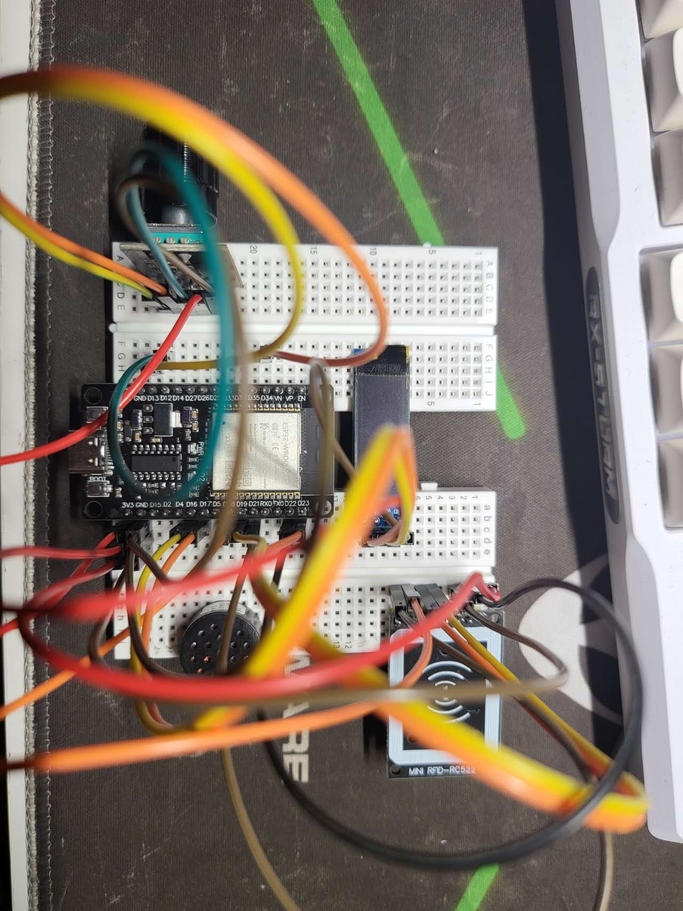

<!-- 
 
  

  &#xa0; -->

<!-- <a href="https://cybersaber.netlify.app">Demo</a> -->

<h1 align="center">CyberSaber</h1>

<h4 align="center"> 
	
	🚧  CyberSaber 🚀 Under construction...  🚧
</h4> 

  <a href="#-about">About</a>   |   
  <a href="#-features">Features</a>   |  
  <a href="#-technologies">Technologies</a>   |  
  <a href="#-requirements">Requirements</a>   |  
  <a href="#-starting">Starting</a>   |  
  <a href="#-license" target="_blank">License</a>   |  
  <a href="https://github.com/KILLERWHOPPER" target="_blank">Author</a>

 

## 🎯 About

My first ESP 32 project, Try to make a replica of [Flipper Zero](https://flipperzero.one/)

## ✨ Features

✔️ [Evil Apple Juice](https://github.com/ckcr4lyf/EvilAppleJuice-ESP32) \
✔️ RFID Read (UID Only for now)\
🚧 RFID Storage \
🚧 RFID Simulate \
🚧 RFID Write

## 🚀 Technologies

The following tools were used in this project:

- [PlatformIO](https://github.com/platformio?utm_source=platformio&utm_medium=piohome)
- [ESP32 Core for Arduino](https://github.com/espressif/arduino-esp32)

## ✅ Requirements

- ESP32 WROOM
- 0.91" Display module with SSD1306
- HW040 Encoder module
- RC522 RFID module

## 🏁 Starting
- Clone this project
- Install PlatformIO from VSCode plugin market
- Open the project in PlatformIO
- Wiring components and connecting ESP32 to the computer
- Upload and Monitor
\

## 📝 License

This project is under license from MIT. For more details, see the [LICENSE](LICENSE) file.

Made with ❤️ by

- <a href="https://github.com/KILLERWHOPPER" target="_blank">KILLERWHOPPER</a>

&#xa0;
